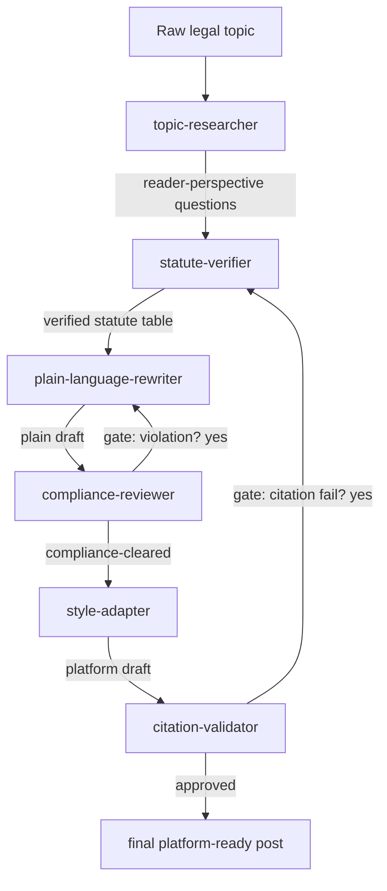

# Architecture

## Goals and constraints

The pipeline must produce content that satisfies three constraints simultaneously:

1. **Legal accuracy**: every statute citation is verifiable and currently effective
2. **Plain-language usability**: a reader without legal training can act on the answer
3. **Regulatory and platform compliance**: the output respects China's Advertising Law, Lawyers Law, Lawyer Practice Code, and per-platform soft rules

These constraints conflict in subtle ways. Plain language wants emphatic verbs ("一定能要回押金"); compliance forbids absolute claims. Platform-style hooks want pain-driven openings; the Advertising Law forbids 焦虑营销. A monolithic prompt that asks an LLM to satisfy all three at once produces drafts that hedge themselves into uselessness or violate one constraint silently.

The architecture below resolves this by **isolating each discipline into its own agent** and verifying each agent's output before the next consumes it.

## Pipeline overview

Two **gates** create non-trivial loops:
- **Stage 4 gate** — if the compliance reviewer finds a violation it considers high-confidence, the orchestrator re-runs Stage 3 with the violation list as additional constraints. Maximum one re-run per gate.
- **Stage 6 gate** — if the citation validator detects drift, the orchestrator re-runs Stage 2 (and consequently 3–5) for the failing citations only. Maximum one full re-run.

These gates are why the system performs **long-chain reasoning** rather than linear translation: a finding at stage 6 can invalidate work all the way back to stage 2, forcing re-derivation with the new constraint.

## Why six agents, not one

A single prompt is faster and cheaper. So why split?

**Reason 1: Single-responsibility produces sharper instructions.** The plain-language rewriter has a focused system prompt that maximises clarity. The compliance reviewer has a focused system prompt that maximises legal safety. A single prompt that tries to balance both ends up with vague instructions that the LLM resolves arbitrarily.

**Reason 2: Auditability.** Every intermediate output is a markdown file. When a published post turns out to have a problem, we can walk back through the chain and identify which stage introduced it. With a monolithic prompt, the failure mode is opaque.

**Reason 3: Independent verification.** Stage 6 (citation validator) does not trust Stage 2's output. It re-pulls from authoritative sources. This is only possible because the stages are isolated; in a monolithic prompt, the model has no way to verify itself against itself.

**Reason 4: Composability.** Each agent has a clear input/output contract. We can swap any single agent without rewriting the rest. When platform rules change, we update Stage 4 and 5 without touching Stages 1–3.

**Reason 5: Human-in-the-loop is incremental.** A human reviewer can approve or reject each intermediate output independently, instead of having to evaluate the whole pipeline at once.

## Stage contracts

Each stage's input and output are markdown files in the run's `outputs/` directory. The contracts are documented in each agent's `agents/<name>.md` file. Summary:

| Stage | Reads | Writes | Owns the discipline of |
|---|---|---|---|
| 1 | (raw topic) | `stage1_research.md` | Reader-perspective question framing |
| 2 | `stage1_research.md` | `stage2_statute.md` | Statute verification |
| 3 | `stage2_statute.md` | `stage3_plain.md` | Plain-language clarity |
| 4 | `stage3_plain.md` | `stage4_compliance.md` | Regulatory + platform compliance |
| 5 | `stage4_compliance.md` + `--platform` flag | `stage5_<platform>.md` | Platform-specific styling |
| 6 | all `stage5_*.md` | `stage6_citation.md`, `final_<platform>.md` | Final independent citation check |

## Orchestrator responsibilities

The orchestrator (in `agents/orchestrator.md`) does **not** generate content. It:
- parses the user's topic and platform flags
- dispatches each stage with the correct upstream output
- inspects each stage's output for malformedness or empty results
- triggers the Stage 4 and Stage 6 gates when appropriate
- writes `run.log` for audit trail
- escalates to the user when the pipeline cannot recover

This separation of concerns (dispatch vs. content generation) keeps the orchestrator small and predictable.

## Failure handling

| Failure | Detection | Recovery |
|---|---|---|
| Empty / malformed output | Orchestrator inspects each stage's output | Re-prompt agent once with same input |
| Compliance violation (high-conf) | Stage 4 returns non-empty violation list | Re-run Stage 3 with violations as constraints (Stage 4 gate) |
| Citation drift | Stage 6 detects mismatch with authoritative source | Re-run Stage 2 for failing citations only (Stage 6 gate) |
| Topic out of scope | Stage 1 flags `Out-of-scope flags` | Orchestrator escalates to user, no further dispatch |
| Real personal data in input | Any stage detects | Hard stop, escalate to user with redaction request |
| Network failure on authoritative source | Stage 2 or Stage 6 cannot reach source | Orchestrator escalates; no fabrication permitted |

## What this is not

- **Not a legal-advice generator.** Every output ends with a disclaimer that this is popsci, not personalised advice.
- **Not a fact-check oracle for arbitrary claims.** The verification scope is limited to statute citations against authoritative legal databases. Factual claims about people, companies, or events are out of scope.
- **Not jurisdiction-portable.** This pipeline is built for mainland-China statutes and platforms. Hong Kong, Macau, Taiwan, or other jurisdictions need their own rule packs.
- **Not a substitute for editorial review.** Every final draft should be read by the human operator before publishing.

## Roadmap (non-binding)

- Add per-platform engagement-history tracking so Stage 5's hook designs improve over time
- Add a Stage 0 "topic deduplication" check to flag recently-published similar topics
- Build a CI workflow that re-runs all checked-in examples on every commit, validating that rule-pack updates don't break historical outputs
- Multi-jurisdiction pluggability (HK / overseas Chinese diaspora law)
